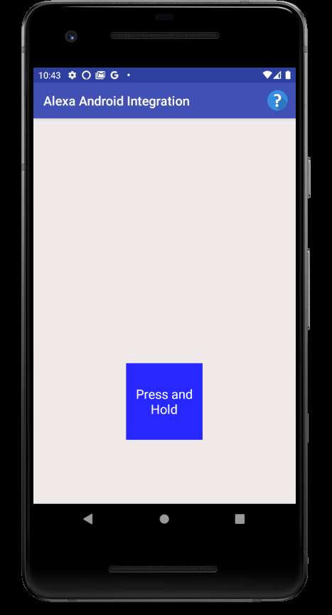
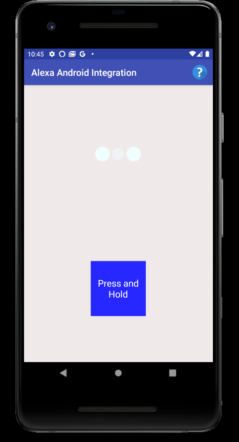
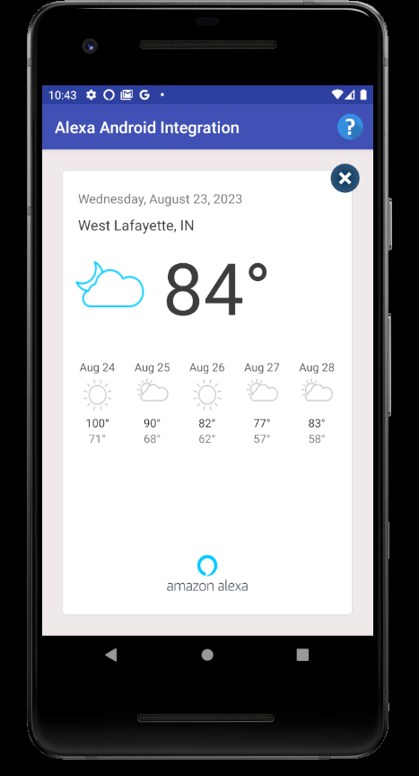

# Alexa Integration for Android: Seamless Voice Interaction

Alexa Android Integration is an Android application that seamlessly integrates [Alexa Voice Service](https://developer.amazon.com/en-US/docs/alexa/alexa-voice-service/get-started-with-alexa-voice-service.html) into the Android ecosystem. This project empowers users to effortlessly interact with essential Alexa functionalities directly from their Android devices. Designed for versatile deployment, the application is compatible with various devices, including Android TV, phones, and tablets.

<table style="margin-left: 23;">
  <tr>
    <td style="text-align: center;">
      
      
"Alexa, what's the weather?"ㅤㅤ  

    </td>
    <td style="text-align: center;">
      
      
Alexa is actively processing user input

    </td>
    <td style="text-align: center;">
      
      
Visual information directly from Alexa

    </td>
  </tr>
</table>

# Key Features

- Alexa Voice Integration: Seamlessly interact with Alexa Voice Service, accessing essential Alexa features through natural voice commands.

- Device Compatibility: Experience Alexa's capabilities across various devices, including Android TV, phones, and tablets.

- Contextual Responses: Alexa provides relevant and informative responses tailored to your queries, enhancing the usability and effectiveness of interactions.

- Volume Control: Easily adjust the volume of your device using simple voice commands, allowing you to fine-tune the audio experience without needing to manually reach for controls.

# Technologies and Deployment Stack

- Integrated Alexa Voice Service (AVS) for interaction with Alexa's voice capabilities.

- Developed within Android Studio.

- Utilized Java and XML for core functionality and user interface design.
